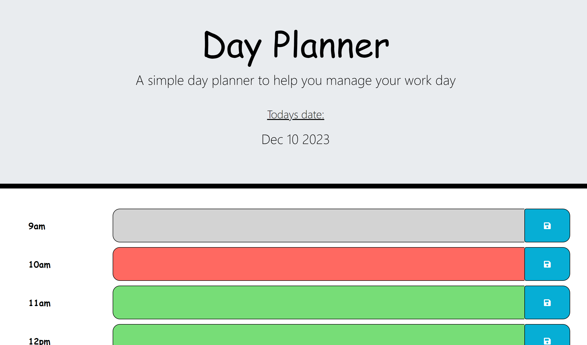
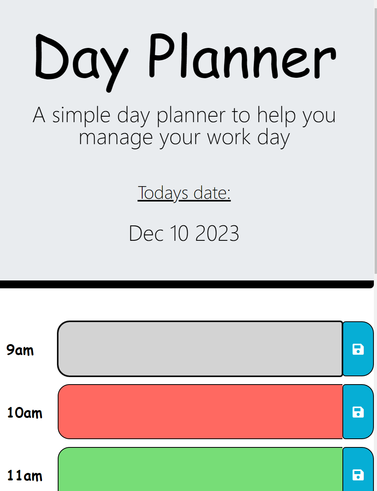

# DayPlanner

I was required to create a simple calendar application that allows a user to save events for each hour of the day by modifying starter code. I utilised the Day.js library to input the date and time. B

To complete this I will write a javascript code that will:

* Show the current date
* Display a different colour for past, present and future time
* Have a space to add important events to a daily planner
* Save written input into the local storage

## Installation

To open the project please follow this link: https://anamorai.github.io/Password-Generator/

## Usage 

Once you open the URL, you will see the following. Grey shows a time past, red shows the present hour and green shows the future.

I have also ensured my design is responsive to various screen sizes. For example on a small screen it will look like this: 

If you were to enter in something incorrectly, I have programmed an alert. It will look like this: 

## Badges

## Features

- A series of prompts for password criteria including:
- Length of password: At least 8 characters but no more than 128.
- Character types: Lowercase, Uppercase, Numeric and Special characters ($@%&*, etc)
- Code validates for each input and requires at least one character type to be selected

## Credits

I would like to refrence my bootcamp course, EdX and my tutor Praktiko for the great lessons provided which gave me the skills necessary to be able to complete this project as well as Web MD for the help when researching methods used in javascript file.

## License

MIT License

Copyright (c) [2023] [Anastasia Moraites]

Permission is hereby granted, free of charge, to any person obtaining a copy
of this software and associated documentation files (the "Software"), to deal
in the Software without restriction, including without limitation the rights
to use, copy, modify, merge, publish, distribute, sublicense, and/or sell
copies of the Software, and to permit persons to whom the Software is
furnished to do so, subject to the following conditions:

The above copyright notice and this permission notice shall be included in all
copies or substantial portions of the Software.

THE SOFTWARE IS PROVIDED "AS IS", WITHOUT WARRANTY OF ANY KIND, EXPRESS OR
IMPLIED, INCLUDING BUT NOT LIMITED TO THE WARRANTIES OF MERCHANTABILITY,
FITNESS FOR A PARTICULAR PURPOSE AND NONINFRINGEMENT. IN NO EVENT SHALL THE
AUTHORS OR COPYRIGHT HOLDERS BE LIABLE FOR ANY CLAIM, DAMAGES OR OTHER
LIABILITY, WHETHER IN AN ACTION OF CONTRACT, TORT OR OTHERWISE, ARISING FROM,
OUT OF OR IN CONNECTION WITH THE SOFTWARE OR THE USE OR OTHER DEALINGS IN THE
SOFTWARE.